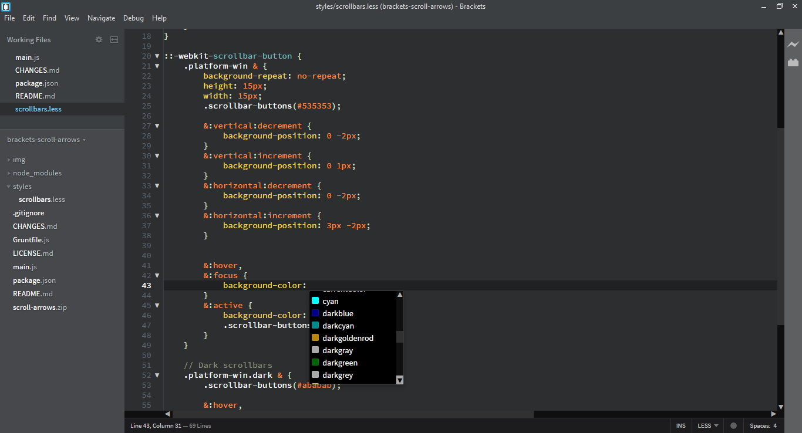
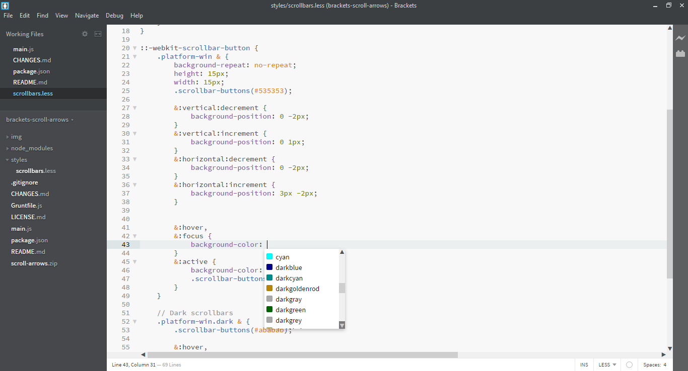

# Brackets Scroll Arrows 
Adds scroll arrows to [Brackets](http://brackets.io)' scrollbars. Windows only.

## Screenshots
With Dark theme on Windows ([Lion](https://github.com/Brackets-Themes/Lion)):

With Light theme on Windows (Brackets Light, preinstalled):

