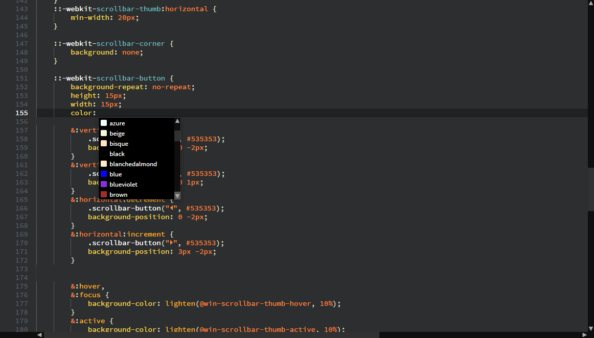
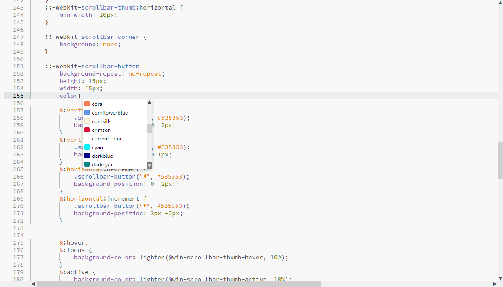

# Brackets Scroll Arrows 
Adds scroll arrows to [Brackets](http://brackets.io)' scrollbars. Windows only for now.

## Screenshots
With Dark theme ([Lion](https://github.com/Brackets-Themes/Lion)):

With Light theme (Brackets Light, preinstalled):

